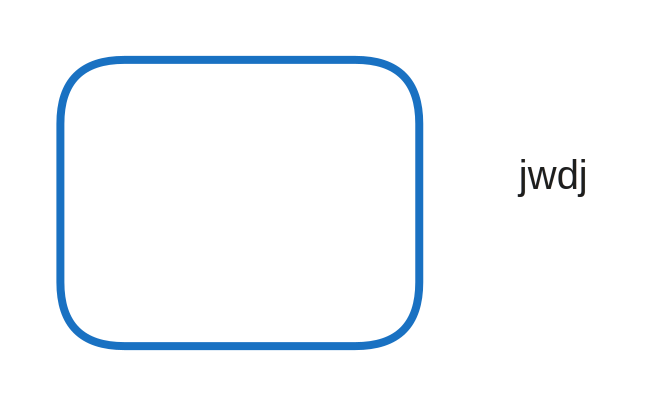

# Architectuur

## Platform Generieke Dienstverlening

&#x20;Het Platform Generieke Dienstverlening is een Common Ground initiatief, voortgekomen uit de behoefte om concreet invulling te geven aan de gedachte van Common Ground. Het bestaat uit een referentie architectuur en referentie componenten, die als geheel een dienstverleningsplatform vormen. Het Platform Generieke Dienstverlening omvat onder meer componenten voor het bouwen van formulieren, zaakafhandeling, logging, archivering en een portaal.

&#x20;Twee belangrijke uitgangspunten binnen deze architectuur zijn:

* Componenten in plaats van monolieten. Dat maakt dat in de toekomst componenten vervangen kunnen worden, zonder dat het gehele platform vervangen hoeft te worden.
* Data gescheiden van business logica. Met als voordeel dat data niet in componenten zit, maar op een gestandaardiseerd formaat en een gescheiden locatie wordt opgeslagen, zodat componenten eenvoudiger vervangen kunnen worden.

Deze architectuur is niet uitgevonden door de Nederlandse gemeentes noch uniek: het is gebaseerd op universele architectuurprincipes. Het is een toepassing van de micro services architectuur. Voor wie daar meer over wil weten, het BOEK.&#x20;

## Scope van NL Portal

NL Portal verzorgt de interactie met klanten en ketenpartners. Klanten zijn natuurlijk personen of organisaties, die partij die een verzoek heeft. Ketenpartners zijn organisaties die gedurende afhandeling van het verzoek een bijdrage leveren.\
\
NL Portal doet geen zaakafhandeling, is geen formulierencomponent en is geen website of content management systeem. Dit zijn wel componenten waarmee typisch interactie plaats vindt.

## Integratiepatronen

NL Portal integreert met de datalaag én omliggende componenten. In deze paragraaf worden eerst algemene principes uitgelegd. NL Portal ondersteunt twee manieren van integratie met omliggende componenten.&#x20;

### Synchrone communicatie

Synchrone communicatie is een communicatiestijl waarbij de vragende service wacht tot er een antwoord is van de antwoordende service. Er is direct contact tussen twee services. Het is een veelgebruikte aanpak - en ook de meest eenvoudige. Synchrone communicatie zijn praktisch vaak calls naar een REST API - maar dat hoeft niet.

#### Voordelen

* Eenvoudig / goedkoop.
* Meest ondersteund. De meeste componenten bieden standaard een REST API aan.

#### Nadelen

* NL Portal wordt afhankelijk van component X. Omdat de vragende service wacht op het antwoord van de leverende service, beinvloedt de snelheid van B die van A. Als voorbeeld, als NL Portal synchroon aan service X vraagt een PDF te genereren en dit duurt 5 seconden, wacht de portal (en de gebruiker) tot de PDF klaar is. Het systeem doet in de tussentijd geen andere dingen. Bij een portal dat intensief door vele gebruikers wordt gebruikt kan dit problemen opleveren.
* Het vervangen van services wordt is mogelijk lastiger. Immers, NL Portal is rechtstreeks verbonden met systeem X - ze kennen elkaar. NL Portal authenticeert zich bij X zoals X dat wenst en vraagt de gegevens van systeem X volgens de specificaties van systeem X. Systeem X kan niet zomaar vervangen worden door een gelijksoortige dienst.
* Het opschalen is lastig.  NL Portal vraagt expliciet systeem X iets te doen. Als er een systeem X' wordt ingezet om werklast op te vangen, werkt dit niet 'uit de doos'.

### **A-synchrone communicatie**

A-synchrone communicatie is een stijl waarbij de vragende service niet wacht op een antwoord van een andere service. Er is geen direct contact tussen de twee services, sterker: de services kennen elkaar niet.

Het principe is gestoeld op voorvallen - 'events'. Een service meldt dat er 'iets' is voorgevallen, zonder daarbij te weten dat daarop iets moet gebeuren. Andere service abonneren zich op deze 'events'. In het geval er een event voorvalt waarop zij moeten handelen, dan doen ze dat.

Binnen de groep koplopers Common Ground is gekozen voor het **informatiearm a-synchroon communiceren**. Dit betekent dat de informatie ('payload') van het bericht niet in de notificatie wordt vastgelegd maar in een separaat bericht. Vanuit de notificatie wordt verwezen naar dit bericht.

<figure><figcaption></figcaption></figure>

1. Vanuit NL Portal wordt een verzoek in de vorm van een object in de [Objects API](https://objects-and-objecttypes-api.readthedocs.io/en/latest/) geplaatst.
2. De objects API notificeert het [notificatie component](https://open-notificaties.readthedocs.io/en/latest/).
3. Het afhandelcomponent is geabonneerd op notificaties van een bepaald type en wordt op de hoogte gebracht van het feit dat er een nieuw bericht is.
4. Het afhandelcomponent vraagt het verzoek op uit de objects API.

####
