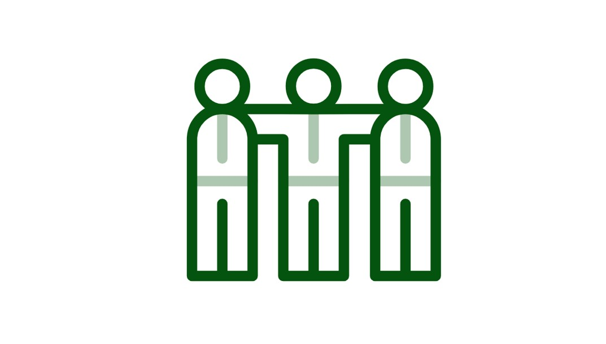

# Repository archived / gearchiveerd

**NL Portal has moved to a single repository at https://github.com/nl-portal/nl-portal.**
All future development and contributions happen there. Please file all issues at
https://github.com/nl-portal/nl-portal-issues. This repository is archived and remains
available in read-only mode for reference.

**NL Portal is verplaatst naar één repository op https://github.com/nl-portal/nl-portal.**
Alle toekomstige ontwikkeling en bijdragen vinden daar plaats. Meld alle issues in
https://github.com/nl-portal/nl-portal-issues. Deze repository is gearchiveerd en blijft
beschikbaar in alleen-lezen modus ter referentie.

---

---
description: >-
  Vind snel je weg in de NL portal informatiepagina. Of je nu op zoek bent naar
  een architectuur overzicht of welke support er beschikbaar is, je vindt het
  allemaal hier.
cover: .gitbook/assets/cover-logo.svg
coverY: 0
---

# Welkom bij NL Portal

|          |  |  |
| ------------------------------------------------ | ------------------------------- | ----------------------------------------- |
| **Getting started**                              | **Support**                     | **Architectuur**                          |
| Bekijk hoe je zo snel mogelijk aan de slag bent. | Stel al je vragen.              | Hoe is NL Portal opgebouwd?               |
