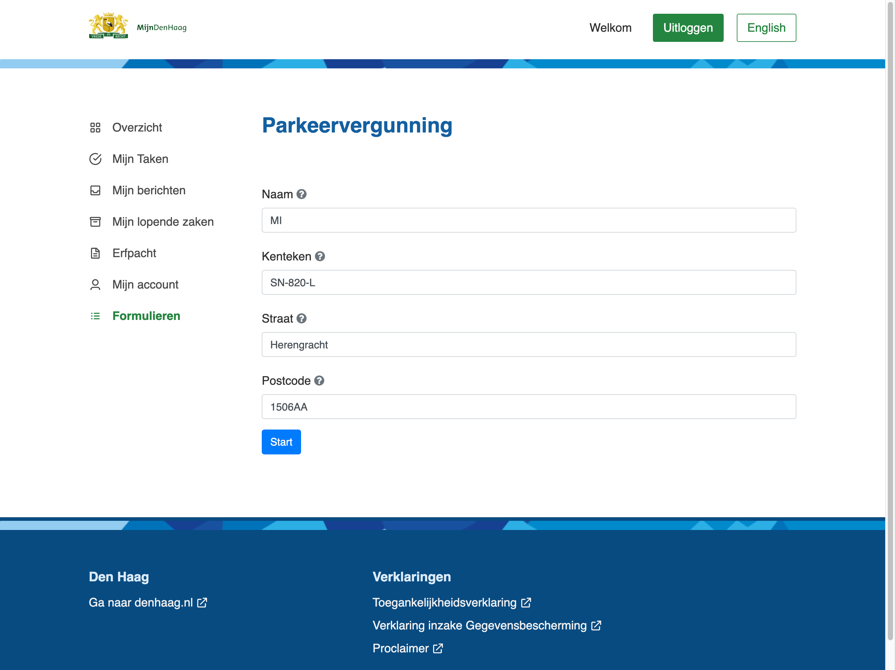
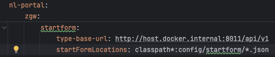
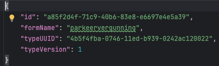
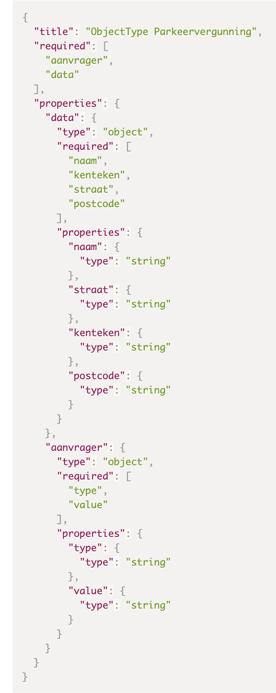

# Start een valtimo case vanuit de portal

## Wat kan je verwachten?
Als je op de formulieren knop klikt in het menu links in beeld krijg je de volgende overzichts pagina: 

Hier staan de geconfigureerde formulieren. In ons voorbeeld alleen parkeervergunning.
Als je hier op klikt krijg je het formulier te zien:

### Wat is de flow?

Na het invullen van het formulier wordt het object naar de backend gestuurd die via een geconfigureerd object infomatie ophaalt
om een call naar de objects api op te bouwen. Bij de objects api heeft elk startform zijn eigen object, hier vind de valitdatie plaats.
Als de waardes geaccepteerd worden word het object op geslagen in de objects api.
Nu kan je in valtimo een notificaties api configureren om een nieuw object op de juiste manier binnen te halen

### Hoe moet je het configureren

**In de backend:** 

Include de startform module in de build.gradle klasse

Je moet in de Yaml de volgende properties configureren onder nl-portal:zgw:startform:
- type-base-url: Hier moet de base url van de objecttypes api komen. let op hier moet ook /api/v1(ofv2) achter 
- StartFormLocations: Hier moet geconfigureerd staat waar de startformconfiguraties staan. LET OP hier moet altijd classpath*: voor staan en *.json achter. 
als je deze niet invult staat startFormLocations op de waarde die je ziet in de screenshot hier onder

Op de plek die je in startFormLocations hebt geconfigureerd moet de configuratie van een startform object komen en dat ziet er alsvolgd uit: 
 
- id: Hier moet een unieke UUID komen. 
- formName: de naam van het formulier heten zoals hij als file opgeslagen staat zonder de .json. 
- typeUUID: de UUID van het object type in de objects api. 
- typeVersion: de versie van het object type. 

**In de objects api en object types api:**

Je moet eerst het objecttype aanmaken in de objectTypes api.
Let op je moet de volgende structuur aanhouden in porperties:
In data zit aanvrager en data
- aanvrager: 
In aanvrager moeten 2 porperties komen: type en value. Hier komt de authenticatie binnen bijvoorbeeld: bsn en 12345678
- data: 
Hier komt het schema van jou object.

 
hierna moet je het object ook linken in de object api op de gebruikelijke manier

**Frontend:**