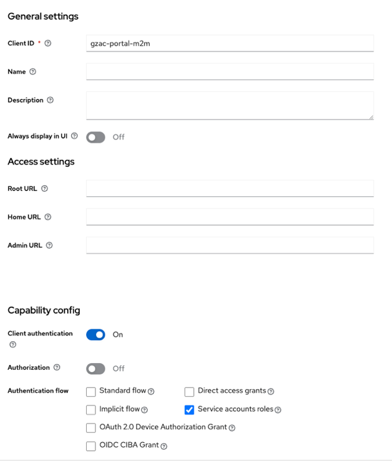
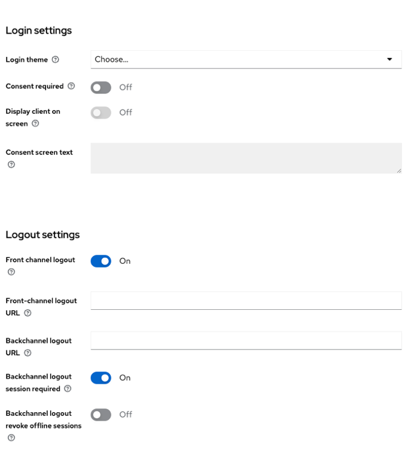
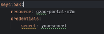
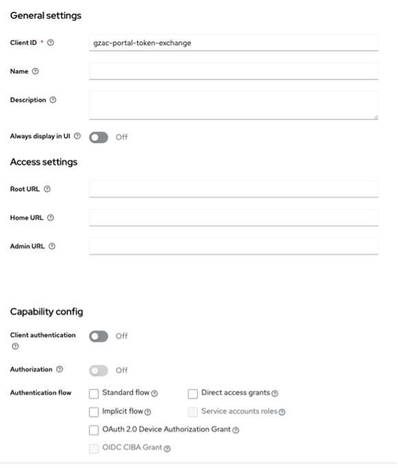
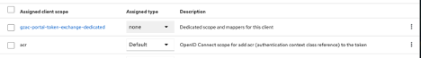
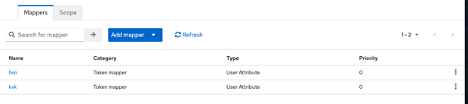
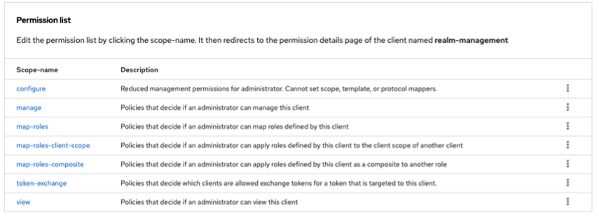
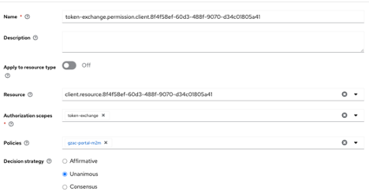
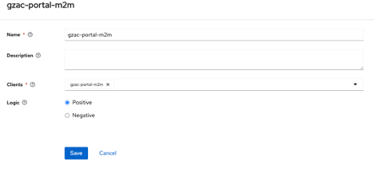

# Token exchange

## Wanneer en hoe gebeurt het?
Als je een api call doet naar de backend word de token onderschept en word er een call naar keycloak gedaan en hier 
word een nieuwe token opgehaald waar de bsn/kvk wel in zit. 
Deze word nu gebruikt in de verdere applicatie

### Hoe moet je keyclaok instellen:

Maak een nieuwe client aan voor de backend.

Op de credentials tab vind je de secret key die je in de application yaml moet zetten. 
 

LET OP: niet zomaar op regenarate klikken dan veranderd de key en kan je niet de oude meer terug zetten.

Hierna creëer je nog een client deze is voor de token exchange. 

Navigeer naar de ‘Client scopes’ tab. Hier klik je op de 1e client scope. 
 
In ons geval met de naam ‘gzac-portal-token-exchange-dedicated’. 
Hierin komen de mappers van de bsn en kvk. 
 
Ga terug naar client details en navigeer nu naar de tab ‘Permissions’. 
Zorg dat de ‘permissions enabled’ op ‘on’ staat. 
Je krijgt een permissions list te zien. Navigeer naar ‘token exchange’. 

Hierin moet je een nieuwe polici maken om de backend client toegang te geven tot een token exchange. 

De policy: 

Hierna moet je nog naar de ‘oude’ al bestaande client om de mappers(kvk en bsn) weg te gooien bij de al bestaande client die nu alleen nog gebruikt zal worden door de frontend.

In de backend moet je nu per omgeving een parameter zetten die de secret en de resource heeft om de token exchange succesvol te kunnen runnen.
