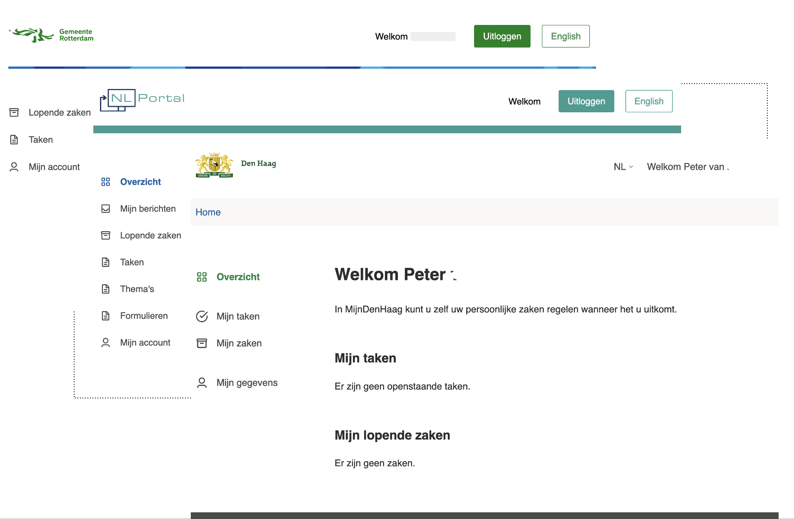

# Eigen vormgeving

NL Portal is opgebouwd met componenten gebaseerd op het [NL design system](https://nldesignsystem.nl/). Om je eigen\
NL Portal vervolgens vorm te geven volgens de huisstijl kun je designtokens gebruiken.\
Designtokens zijn kleine stukjes van het designsysteem die ontwerpbeslissingen vertegenwoordigen\
zoals kleuren en lettertypes.

_Drie verschillende klantportalen met verschillende vormgeving door middel van design tokens_

Om je eigen vormgeving toe te passen ga je naar je eigen frontend template repository. In deze\
repository ga je naar het bestand /src/styles/nl-portal-design-tokens.css. Hier kun je eigen\
designtokens toevoegen die de standaard waardes overschrijven.

Een voorbeeld van een design token is:

```
 --nlportal-header-bar-background-color: #03801f;
```

Hiermee wordt de kleur van het element header bar ingesteld op #03801f;.

De makkelijkste manier om te achterhalen met welk design token je een bepaald component kunt\
instellen is door in de [developer toolbar ](https://developer.chrome.com/docs/devtools/overview)met de inspector te kijken.

_Een voorbeeld vanhet designtoken nlportal-current-page-indicator-background-color_

In het voorbeeld hierboven is een knop geselecteerd. In het omcirkelde deel is zichtbaar dat\
de achtergrondkleur van de knop wordt ingesteld met het designtoken\
nlportal-current-page-indicator-background-color.

Door dit token op te nemen in het eigen styles bestand en de waarde te veranderen kun je de\
kleur aanpassen. Een voorbeeldbestand is te vinden op de[ NL Portal github](https://github.com/nl-portal/nl-portal-frontend-template/blob/master/src/styles/nl-portal-design-tokens.css).
