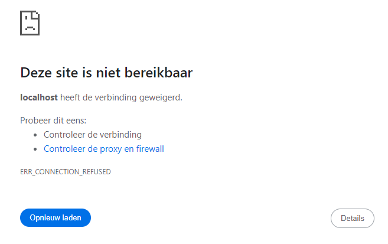
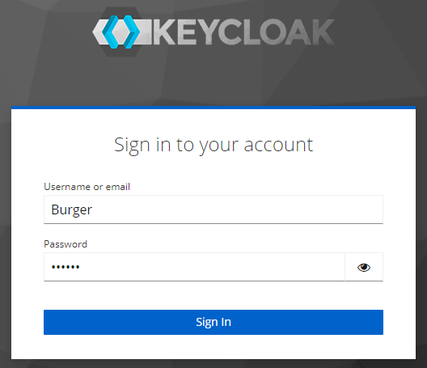
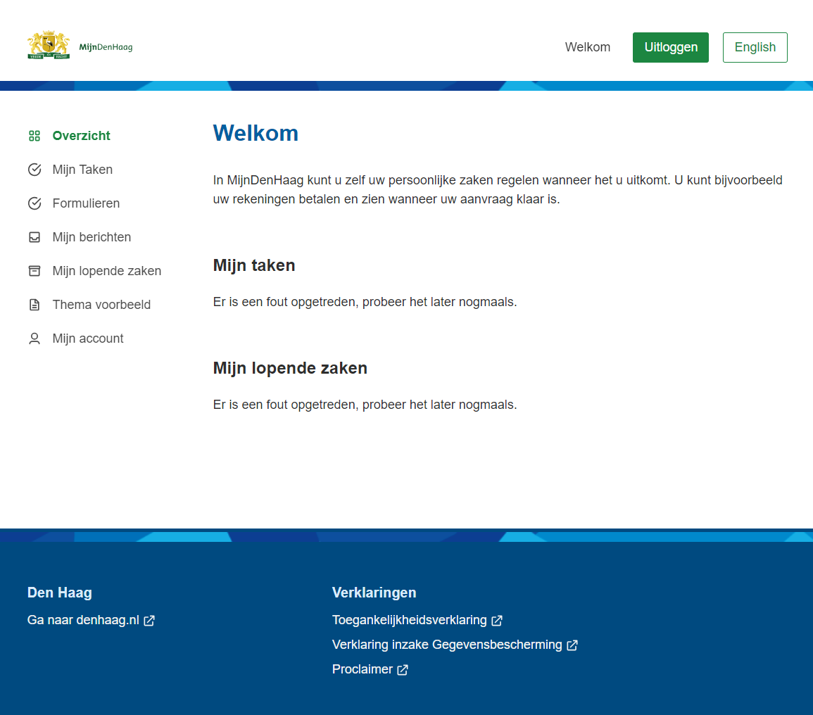

# Opzetten NL Portal

### Wat heb je nodig

Om de NL Portal op te zetten is er enige kennis van technische tools en de CLI (command-line interface) vereist.

#### Waar kan ik de code vinden

Alle code en informatie is opensource en kan gevonden worden op [github.com](https://github.com/nl-portal). De NL Portal is opgesplitst in meerdere repositories. Hieronder een korte beschrijving van elk.

| Repository                                                                      | Beschrijving                                                                                                     |
| ------------------------------------------------------------------------------- | ---------------------------------------------------------------------------------------------------------------- |
| [Documentatie](https://github.com/nl-portal/documentation)                      | Documentatie over de NL Portal                                                                                   |
| [Frontend Template](https://github.com/nl-portal/nl-portal-frontend-template)   | Template om een nieuwe NL Portal app frontend te starten, de perfecte basis om mee beginnen                      |
| [Backend Template](https://github.com/nl-portal/nl-portal-backend-template)     | Template om een nieuwe NL Portal app backend te starten                                                          |
| [Frontend Libraries](https://github.com/nl-portal/nl-portal-frontend-libraries) | Libraries voor de frontend die gebruikt worden in de frontend template                                           |
| [Backend Libraries](https://github.com/nl-portal/nl-portal-backend-libraries)   | Libraries voor de backend die gebruikt worden in de backend template                                             |
| [Docker Compose](https://github.com/nl-portal/nl-portal-docker-compose)         | Een docker compose setup om het ZGW landschap op te zetten die gebruikt kunnen worden door de NL Portal          |
| [Helm Charts](https://github.com/nl-portal/helm-charts)                         | Kubernetes Helm charts die het makkelijker maakt om een NL Portal omgeving op te zetten op de kubernetes cluster |

Niet al deze repositories zijn nodig om een NL Portal app te maken. Hieronder vind je een stappen plan waarmee je kan beginnen!

### Je eerste NL Portal app

Om een minimale versie van de NL Portal op te zetten zal je de enkele repositories moeten clonen op je lokale machine en 1-voor-1 uitvoeren.

**Frontend**

De eerste repository is de [Frontend Template](https://github.com/nl-portal/nl-portal-frontend-template) deze geeft een goede start voor eventueele aanpassingen die je wilt doen om de frontend eigen te maken. In het README.md bestand staat wat je moet uitvoeren en benodigd hebt onder het kopje **Development**.

**Authenticatie**

Zodra de frontend draait, zal je merken dat je doorgestuurd wordt naar een pagina die niet bestaat. Dit komt omdat standaard de NL Portal authenticatie verloopt via [Keycloak](https://www.keycloak.org/) en om het opzetten en developen voor de NL Portal makkelijker te maken hebben wij een [Docker Compose](https://github.com/nl-portal/nl-portal-docker-compose) repository gemaakt waar alle benodigdheden om de NL Portal op te starten in zit.

_Wanneer je voor het eerst de NL Portal opstart zonder een Keycloak instantie_

Voor nu is het genoeg om alleen **Keycloak en database only** stukje te volgen in de README.md van de [Docker Compose](https://github.com/nl-portal/nl-portal-docker-compose) repository.

Als je dan weer naar de NL Portal gaat, dan zal je zien dat je nu wordt doorgestuurd naar een Keycloak loginscherm. Hier kan je inloggen met gebruiker **burger** en wachtwoord **burger**.

_Keycloak inlogscherm_

**Backend**

Nu ben je ingelogd via Keycloak op de NL Portal, maar je kan niet zoveel aangezien de NL Portal nog niet aangesloten is op de backend. Hiervoor ga je naar de [Backend Template](https://github.com/nl-portal/nl-portal-backend-template) repository en volg je de stappen in de README.md.

_Eerste stap in het maken van je eigen NL Portal app_

Zodra de backend draait kan je de NL Portal app refreshen in je browser, en dan zie je dat er ook data beschikbaar is. Je eerste NL Portal app is een feit!

### Vervolg stappen

Nu de eerste NL Portal app gemaakt is kan je verder werken aan de NL Portal om het eigen te maken. Updaten van de vormgeving, aanpassen van de menu's en meer. Het staat je tenslotte geheel vrij om de NL Portaal te pakken en deze aan te passen naar jou wensen. Opties zijn om te koppelen met Openzaak, Objects API, OpenKlant en/of HaalCentraal.
