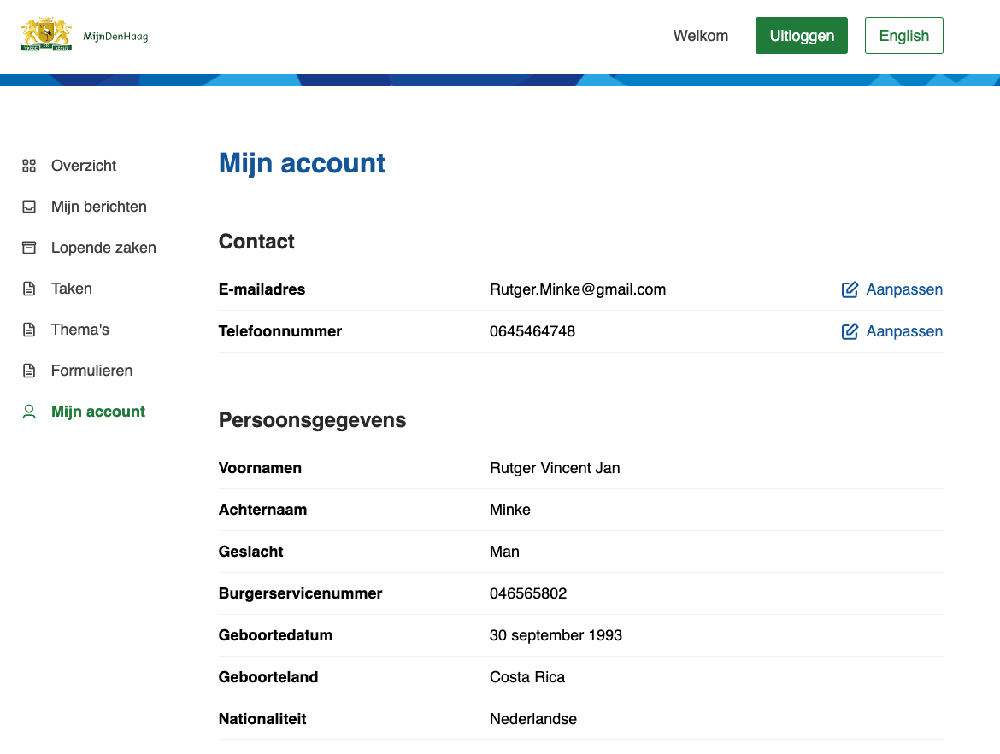
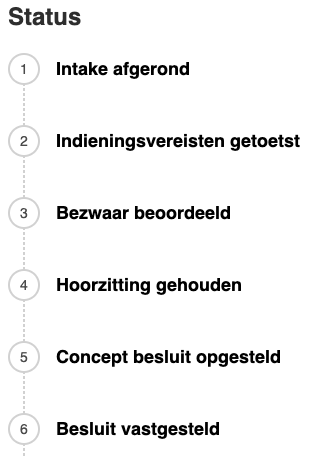
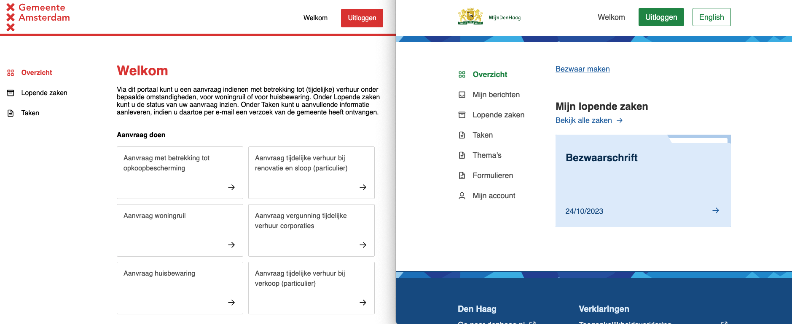

# Features

NL Portal heeft veel functionaliteiten out of the box, en is volledig modulair uitbreidbaar. Alle functionaliteiten zijn optioneel en kunnen aan of uitgezet worden. 

### Beveiligde omgeving
Bezoekers van de NL Portal kunnen in een beveiligde omgeving inloggen om hun gegevens in te zien. NL Portal gebruikt keycloak als access management service en kan gebruik maken van bijvoorbeeld digid, eHerkenning of ADFS.

### Profielpagina
Binnen NL Portal is onder andere een profielpagina component. Deze profielpagina kan koppelen met HaalCentraal en zo de informatie uit de basisadministratie tonen.

### Zaakinformatie
Binnen NL Portal draait alles om zaken. NL Portal kan de zaakinformatie van een gebruiker realtime tonen en geeft ook de status van de zaak weer. Zo weet een gebruiker altijd waar hij aan toe is en hoeft hij niet telefonisch contact op te nemen.

### Veilige bestandsuitwisseling
In NL Portal kun je eenvoudig en veilig bestanden uitwisselen met de klant. Dit kan zowel gaan om het veilig toesturen van een bestand vanuit de organisatie naar de klant of de klant kan veilig een bestand uploaden naar de organisatie. Dit bestand wordt gekoppeld aan de juiste zaak en voorzien van de nodige metadata. Veilig en AVG proof.

### Design system
NL Portal gebruikt NL Design system als frontend. In dit design system zijn alle technische voorbereidingen voor het voldoen aan webtoegankelijkheidsregels zoals WCAG al getroffen. Daarnaast is het eenvoudig test stylen in de eigen huisstijl.

