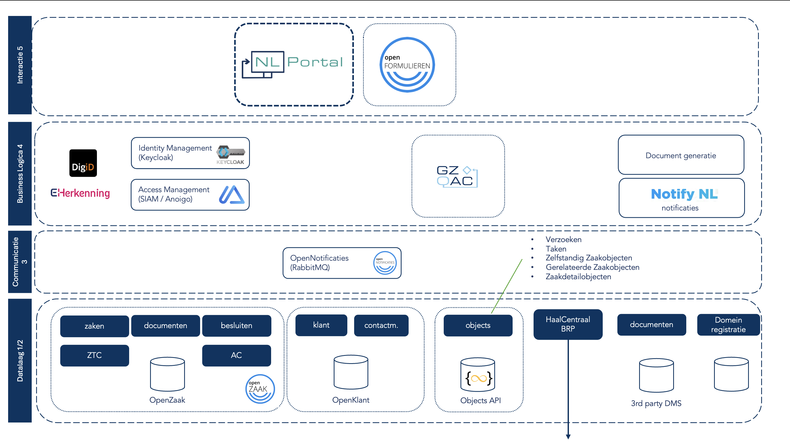

# 5-lagenmodel

Het 5-lagenmodel van Common Ground is een architectuuraanpak ontwikkeld door de Nederlandse gemeenten om de gemeentelijke IT-architectuur te moderniseren en efficiënter te maken. Twee belangrijke aspecten zijn:&#x20;

1. Het scheiden van data en applicaties. Door data in een gestandaardiseerd formaat op te slaan in een datalaag, wordt voorkomen dat dat in applicaties zit, waardoor de _lockin_ op applicaties wordt verminderd én data-duplicering wordt voorkomen.&#x20;
2. Het gebruik van componenten in plaats van monolitische silo-applicaties, waardoor componenten vervangbaar zijn en er minder afhankelijkheid ontstaat van één leverancier van een totaaloplossing.&#x20;

NL Portal is een component binnen dit model. Hieronder weergegeven in laag 5, de 'interactielaag'.

*5 lagen model Common Ground*

### Scope NL Portal

NL Portal heeft als doel de communicatie met klanten (belanghebbenden) en ketenpartners te verzorgen. NL Portal voorziet in:&#x20;

* Berichten
* Taken
* Inzicht in Zaakdossiers
* Inzicht in Mijn Gegevens (BRP)
* Track & trace van Zaken
* Inzicht domein-specifieke gegevens (in ontwikkeling)

### Buiten scope

* Informatieverstrekking. (CMS)
* Authenticatie. (bijv. SIAM of Keycloak)
* Notificaties (email, sms, whatsapp). (bijv. NL Notify)
* Zaakafhandeling (bijv. GZAC)

