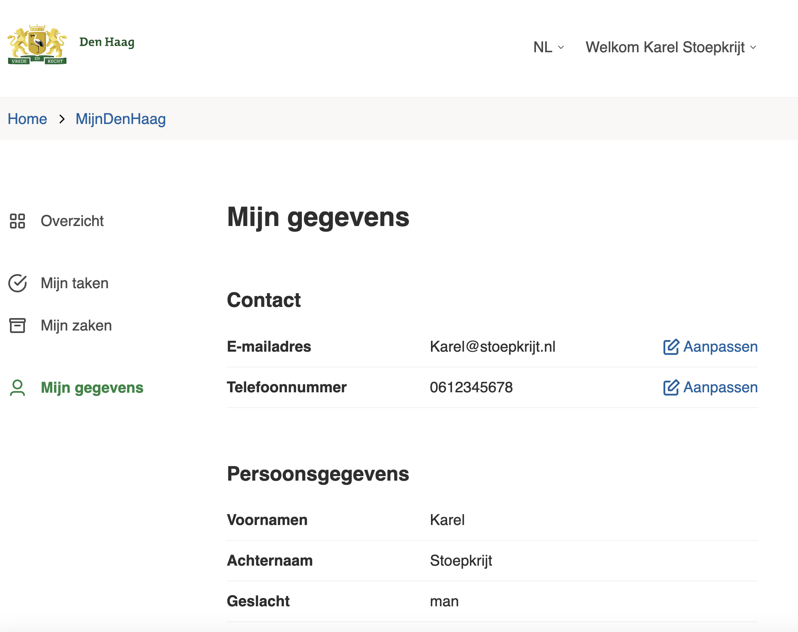

# Mijn gegevens

NL Portal bevat een module waarmee een inwoner zijn of haar informatie die vastgelegd is in de Basis Registratie Personen kan bekijken. Deze informatie wordt opgehaald uit de Basis Registratie met de [Haal Centraal BRP](https://vng.nl/projecten/haal-centraal-gegevens-ophalen-bij-basisregistraties) connectie.

*Schermafbeelding van klantportaal.denhaag.nl functionaliteit mijn gegevens*
