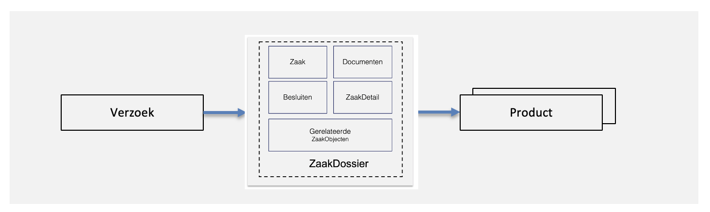

# Product

Een product is het mogelijk resultaat van een verzoek. Het formaat van een product is gestandaardiseerd in een JSON formaat. Het verzoek kan worden aangemaakt via een component naar keuze, in veel gevallen een zaak- of taakafhandelapplicatie. Voorbeelden van producten zijn een vergunning of rijbewijs.

_Producten worden nog gestandaardiseerd, deze worden tijdelijk opgeslagen in de Objects API, het plan is om de Producten- en Dienstencatalogus in 2025 te realiseren. NL Portal zal hierop aansluiten._
