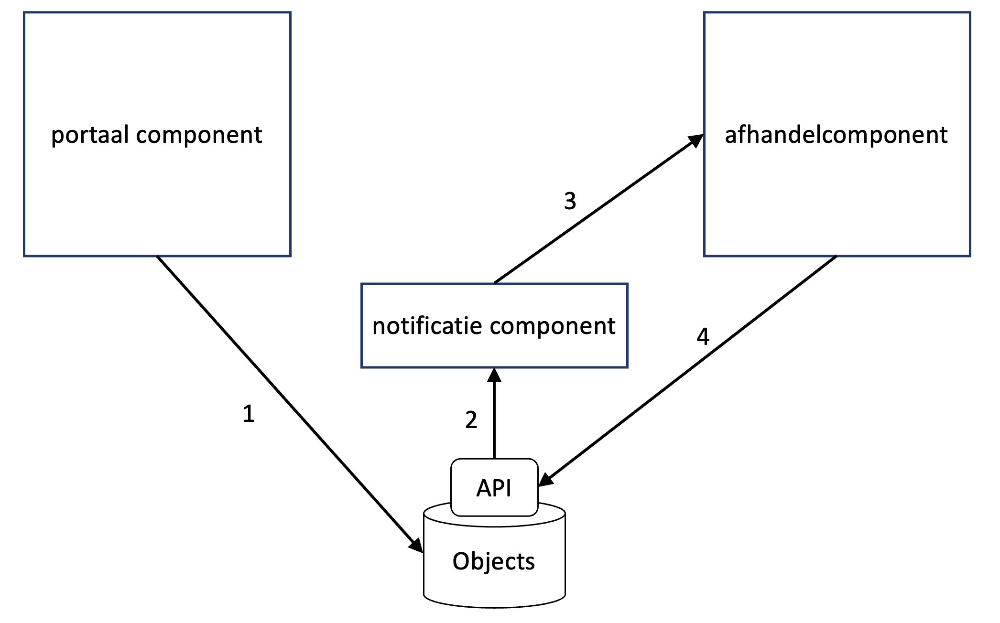

# Patronen

NL Portal integreert zowel met de datalaag als met omliggende componenten. In deze paragraaf worden eerst algemene principes uitgelegd. NL Portal ondersteunt twee manieren van integratie: synchrone en asynchrone communicatie.

### Synchrone Communicatie

Synchrone communicatie is een stijl waarbij de vragende service wacht tot er een antwoord komt van de antwoordende service. Er is direct contact tussen twee services. Dit is een veelgebruikte en eenvoudige aanpak. Synchrone communicatie betreft vaak calls naar een REST API, maar dat is niet noodzakelijk.

**Voordelen:**

* **Eenvoudig en goedkoop:** Synchrone communicatie is makkelijk te implementeren en kosteneffectief.
* **Breed ondersteund:** De meeste componenten bieden standaard een REST API aan.

**Nadelen:**

* **Afhankelijkheid:** NL Portal wordt afhankelijk van de snelheid van de antwoordende service. Als bijvoorbeeld een PDF-generatie door service X vijf seconden duurt, moet NL Portal (en de gebruiker) die tijd wachten.
* **Moeilijk te vervangen:** Omdat NL Portal rechtstreeks verbonden is met systeem X, is het moeilijk om X te vervangen door een gelijksoortige dienst zonder aanpassingen.
* **Schaalbaarheid:** Het is lastig om op te schalen. NL Portal vraagt expliciet aan systeem X om een taak uit te voeren. Het toevoegen van een extra systeem X' om de werklast te verdelen werkt niet direct 'uit de doos'.

### Asynchrone Communicatie

Asynchrone communicatie is een stijl waarbij de vragende service niet wacht op een antwoord. Er is geen direct contact tussen de services; sterker nog, de services kennen elkaar niet.

Het principe is gebaseerd op gebeurtenissen ('events'). Een service meldt dat er iets is voorgevallen zonder te weten wat daarop moet gebeuren. Andere services abonneren zich op deze 'events'. Als er een event plaatsvindt waarop zij moeten handelen, doen ze dat.

Binnen de Common Ground-gemeenschap is gekozen voor _informatiearme_ asynchrone communicatie. Dit betekent dat de informatie ('payload') van het bericht niet in de notificatie wordt vastgelegd, maar in een apart bericht. De notificatie verwijst naar dit bericht.

**Voorbeeld: het Verzoek**

<figure><figcaption></figcaption></figure>

1. Vanuit NL Portal wordt een Verzoek in de vorm van een object in de Objects API geplaatst.
2. De Objects API notificeert het notificatiecomponent.
3. Het afhandelcomponent is geabonneerd op notificaties van een bepaald type en wordt op de hoogte gebracht van het feit dat er een nieuw bericht is.
4. Het afhandelcomponent vraagt het verzoek op uit de Objects API.

