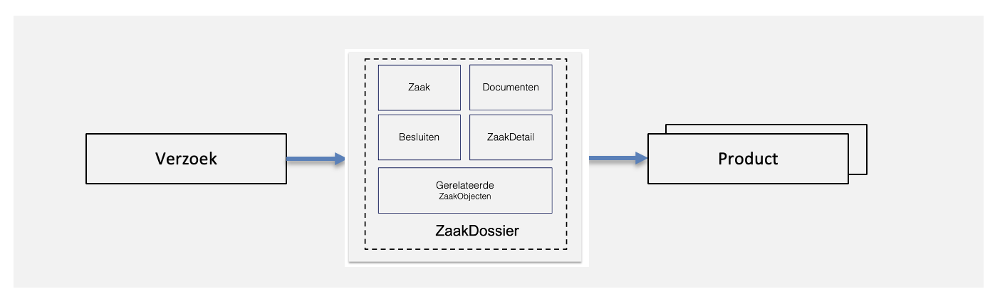
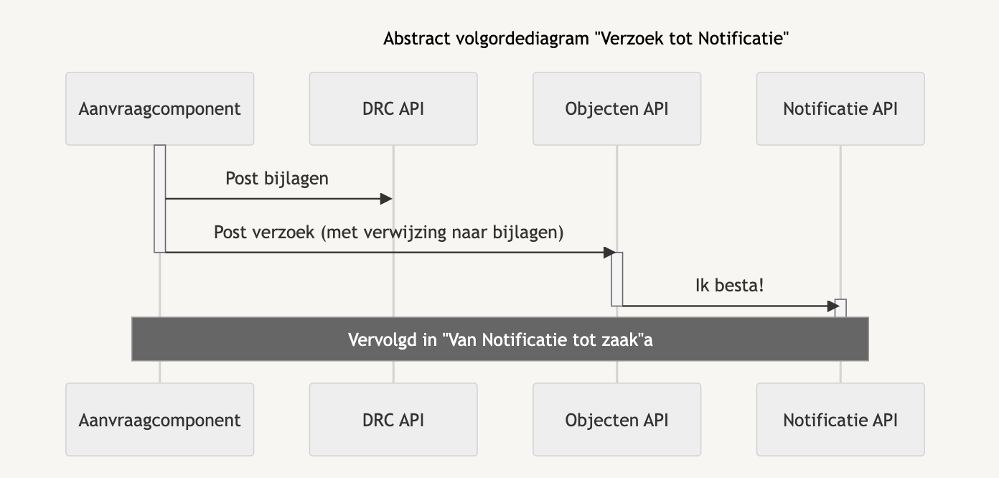

# Verzoek

Een verzoek is de informatie en trigger die mogelijk leidt tot het leveren van een product of dienst. Een verzoek kan afkomstig zijn van een klant in de vorm van een natuurlijk persoon, een gemachtigde of een organisatie.

Het formaat van een verzoek is gestandaardiseerd in een JSON formaat. Het verzoek kan worden aangemaakt via een component naar keuze, in veel gevallen een formulierencomponent, maar ook een scanstraat of een zaakafhandelsysteem van een organisatie kunnen verzoeken indienen.

*Van verzoek via de zaak naar een product*

### Sequence diagram

Indien er documenten (enkelvoudig zaakinformatieobject) horen bij een verzoek, dan worden deze eerst vastgelegd in via de Documenten API. Vervolgens wordt het verzoek ingediend, met daarin verwijzingen naar de bijbehorende documenten. De vastlegging vindt plaats in de Objecten API. _Note: mogelijk wordt deze in de toekomst vervangen door een verzoeken API._

De Objecten API notificeert de notificatie componenten, die het juiste component in het achterliggende landschap notificeert.&#x20;

*Sequence diagram 'verzoek'*
