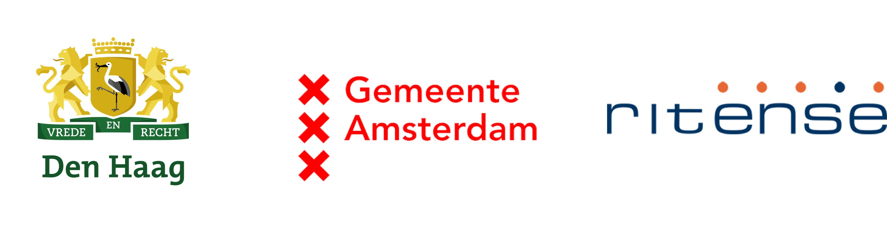

# Open source

### Uitgangspunten ontwikkeling NL Portal

* Open standaarden, open source licentie EUPL 1.2;
* Compatible met diverse formulierapplicaties;
* Frontend UI gebaseerd op [NL Design System](https://nldesignsystem.nl/);
* Voldoet aan alle web toegankelijkheidsrichtlijnen (WCAG);
* Onafhankelijk van proces- of zaak management systemen;
* Horizontal schaalbaar.

### Bijdrage leveren

Alle code is publiek beschikbaar op onze [github](https://github.com/nl-portal/). We zijn trots op ons werk, laten je graag meer zien of helpen je op gang te komen.

### Feature of bugfixes toevoegen

1. Maak een issue aan in de [Frontend](https://github.com/nl-portal/nl-portal-frontend-libraries) of [Backend](https://github.com/nl-portal/nl-portal-backend-libraries) repository. Hiermee willen we zorgen dat alle bugfixes en features afgestemd zijn op elkaar zodat we geen dubbel werk doen
2. Implementeer de feature of bugfix, test deze en maak een PullRequest naar de development branch
3. Schrijf de release notes en documentatie
4. Merge de branch als je een akkoord hebt van het Portal team

We streven naar een maandelijkse release, mocht je sneller een fix of feature nodig hebben laat het ons weten.

### Deelnemers

<figure><figcaption></figcaption></figure>
