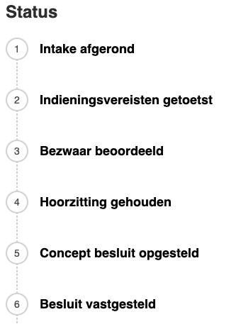
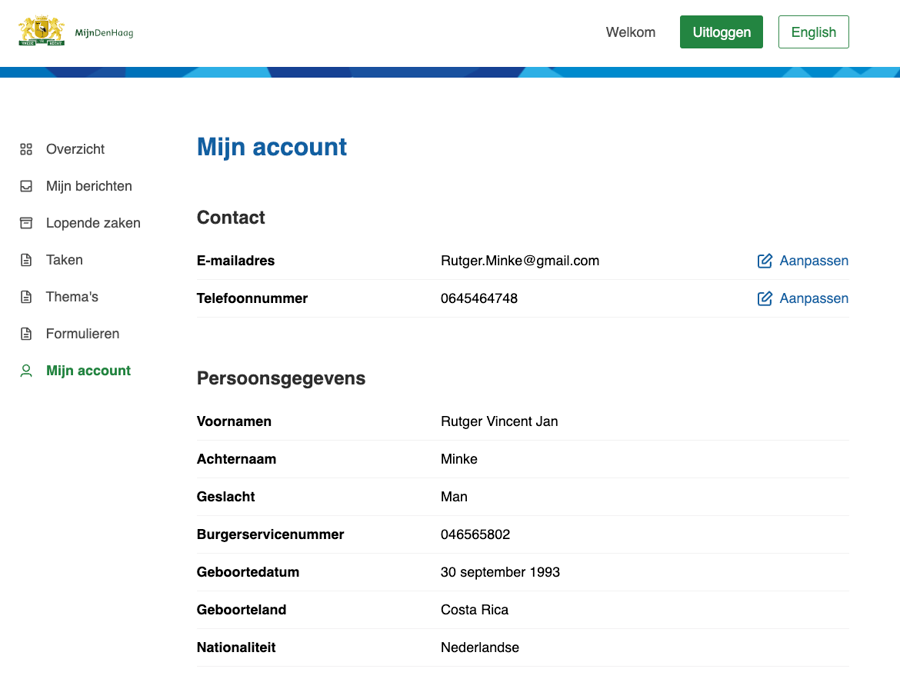

# Wat is NL Portal

### **Wat is het?**

NL Portal is een open source Mijn Omgeving voor gemeentelijke- én andere overheden. Inwoners en bedrijven kunnen hierop een veilige manier inloggen om informatie te vinden die voor hun relevant is.&#x20;

Zo kan je

• Je persoonlijke gegevens en adresgegevens raadplegen;\
• Producten en diensten inzien die je bij de gemeente afneemt,

Op één centrale plek, waar je 24/7 terecht kunt.&#x20;

In deze wat verouderde video van de lancering wordt de achtergrond uitgelegd.



### **Productvisie**

Het heeft drie doelen, voor drie doelgroepen:

1. Gemak voor burgers en ondernemers.
2. Efficiëntie in de uitvoering voor overheden.
3. Voldoen aan wet- en regelgeving voor beleidsmakers.

**Gemak voor burgers en ondernemers**

We zijn gewend geraakt aan het gemak van online diensten. Een bestelling die vandaag wordt geplaatst en morgen of zelfs vandaag al wordt geleverd, is nu de norm. Burgers en ondernemers verwachten dezelfde efficiëntie van de overheid. NL Portal helpt hierbij door eenvoudig online aanvragen te kunnen indienen, inzicht te hebben in de afhandeling, toegang hebben tot producten en diensten online en snelle levering te ervaren. Kijk naar de&#x20;

**Efficientie in de uitvoering voor overheden**

Overheden hebben een enorme informatiestroom te verwerken. Dat moet sneller, met minder fouten en met minder mensen. Door automatisering kan een deel van de informatiestroom geautomatiseerd verwerkt worden, waardoor tijd vrij wordt gespeeld voor burgers en ondernemers die persoonlijke aandacht verdienen.

NL Portal zorgt voor gestandaardiseerde digitale communicatie met burgers en ondernemers. De verwerking van data wordt daardoor vereenvoudigd. Kwaliteit in = kwaliteit uit. NL Portal volgt de standaarden vanuit het Common Ground project 'Samenwerkende Portalen' - elk backoffice systeem dat deze standaarden volgt kan communiceren via NL Portal.

**Voldoen aan wet- en regelgeving voor beleidsmakers**

De wet- en regelgeving stelt hogere eisen aan digitale diensten van overheidsinstellingen. Toegankelijkheid, beveiliging, omgang met persoonsgegevens, auditing, taalgebruik, data-integriteit, beschikbaarheid en snelheid. BIO, ISO, AVG, WCAG, DigiD Assessment. NL Portal heeft tot doel 'uit de doos' technisch voldoen aan eisen.

NL Portal heeft de volgende uitgangspunten:

* Open standaarden, open source licentie EUPL 1.2;
* Compatible met diverse formulierapplicaties;
* Frontend UI gebaseerd op [NL Design System](https://nldesignsystem.nl/);
* Voldoet aan alle web toegankelijkheidsrichtlijnen (WCAG);
* Onafhankelijk van proces- of zaak management systemen;
* Horizontal schaalbaar.

### **Functionaliteiten**

Op dit moment kent NL Portal de volgende functionaliteiten

* Koppeling met DigiD en eHerkenning
  * DigiD en eHerkenning zijn vertrouwde systeem voor gebruikers, verhoogt de beveiliging door betrouwbare identiteitsverificatie, en biedt gemak doordat veel mensen al een DigiD hebben.
* Bezoekers kunnen nieuwe zaken aanmaken;
  * Inwoners en bedrijven kunnen via dit proces de start van een nieuwe zaak initieren.&#x20;
*   Bezoekers kunnen altijd de actuele status van hun zaken zien;
    * Track & trace-service waar inwoners en medewerkers aanvragen kunnen volgen. Deze service is vooral gericht op het bieden van inzicht in gegevens en minder op interactie. 
    
* Bezoekers kunnen Taken krijgen in NL Portal
  * Hiermee kunnen inwoners direct zelf zaken regelen bij de gemeente. Deze service laat acties zien die nog door een inwoner of een medewerker moeten worden uitgevoerd. Inwoners kunnen hier bijvoorbeeld extra gegevens aanleveren voor een lopende zaak en in de toekomst kunnen ze een betaling doen in NL Portal.
* Bezoekers kunnen bestanden downloaden
  * Bezoekers kunnen de documenten die gekoppeld zijn aan hun zaak downloaden. Dit kunnen bijvoorbeeld de besluitdocumenten zijn.&#x20;
*   Bezoekers hebben een profielpagina
    * Binnen NL Portal is onder andere een profielpagina component. Deze profielpagina kan koppelen met HaalCentraal en zo de informatie uit de basisadministratie tonen.
    
