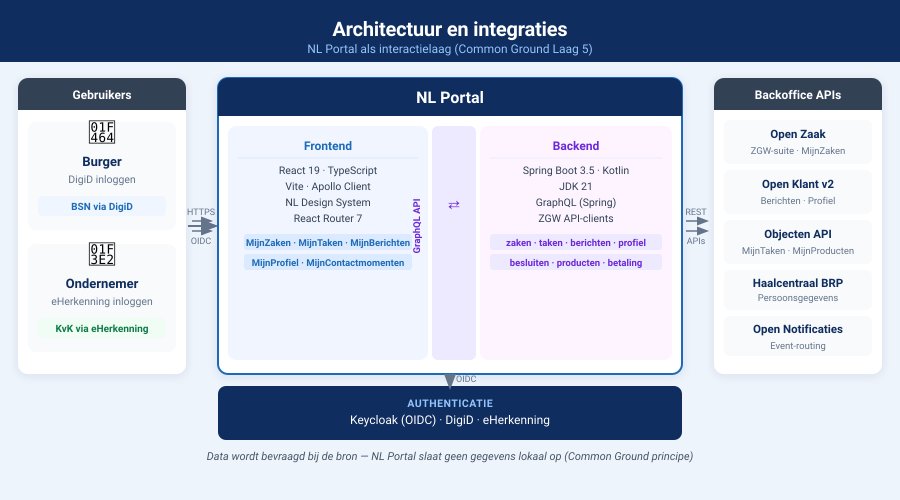

# Integraties

NL Portal communiceert met externe systemen via gestandaardiseerde VNG API-standaarden. De onderstaande tabel geeft een overzicht van alle integraties: welke standaard gebruikt wordt, waarvoor, en welke referentie-implementatie er bestaat.

---

## Overzicht

| Integratie | Standaard | Referentie-implementatie | MijnServices-bouwsteen |
|---|---|---|---|
| Zaken, documenten, besluiten | ZGW-suite: Zaken API, Catalogi API, Documenten API, Besluiten API | [Open Zaak](https://openzaak.org/) | MijnZaken |
| Klantinteracties en berichten | Klantinteracties API + Contactgegevens API | [Open Klant](https://github.com/maykinmedia/open-klant) (v2) | MijnBerichten, MijnContactmomenten, MijnProfiel |
| Taken | Objecten API + Objecttypen API | [Open Zaak Objecten](https://github.com/open-zaak/open-zaak) | MijnTaken |
| Persoonsgegevens | Haalcentraal BRP Personen API v2 | — (via gemeentelijke BRP-aansluiting) | MijnProfiel |
| Bedrijfsgegevens | Haalcentraal Handelsregister API | — (via gemeentelijke HR-aansluiting) | Ondernemer-login |
| Producten en diensten | Producttypecatalogus / Objecten API | [Open Product](https://github.com/maykinmedia/open-product) | MijnProducten |
| Notificaties | Notificaties API (ZGW-suite) | [Open Notificaties](https://github.com/open-zaak/open-notificaties) | Notificatieservice |
| Autorisatie | ZGW Autorisaties API | Open Zaak | — |

---

## ZGW API-suite

De **ZGW API-suite** is een formeel vastgestelde VNG-standaard (versie 1.5) gebaseerd op het RGBZ 2.1-informatiemodel. Het is de meest volwassen standaard in het MijnServices-ecosysteem.

De suite bestaat uit:

- **Zaken API** — zaakregistratie en -opvraging; statussen en rollen
- **Catalogi API** — zaaktypecatalogus (ZTC); bepaalt welke zaaktypen en statussen bestaan
- **Documenten API** — documenten gekoppeld aan zaken (zaakinformatieobjecten)
- **Besluiten API** — besluiten gekoppeld aan zaken
- **Notificaties API** — event-routing tussen componenten (informatie-arm principe)
- **Autorisaties API** — autorisatiebeheer voor ZGW API-consumers

Specificaties: [vng-realisatie.github.io/gemma-zaken](https://vng-realisatie.github.io/gemma-zaken/standaard/)

**Referentie-implementatie**: [Open Zaak](https://openzaak.org/) (Maykin Media, in gebruik bij ~40 gemeenten)

---

## Klantinteracties API en Contactgegevens API

Deze standaarden vervangen de verouderde Klanten API en Contactmomenten API. Ze worden gebruikt voor MijnBerichten, MijnContactmomenten en MijnProfiel.

> **Let op**: *Open Klant* is de **referentie-implementatie** van deze standaarden — geen standaard zelf. Versie 2 van Open Klant implementeert de Klantinteracties API en de Contactgegevens API.

Specificaties: [vng-realisatie.github.io/klantinteracties](https://vng-realisatie.github.io/klantinteracties/)

**Status**: De standaard is bij VNG Realisatie gepubliceerd "as is, where is" onder EUPL. Actieve doorontwikkeling is momenteel gepauzeerd. Open Klant is ontwikkeld door Maykin Media, samen met VNG Realisatie en gemeenten Amsterdam, Den Haag en Utrecht.

---

## Haalcentraal BRP Personen API

NL Portal haalt persoonsgegevens op via de **Haalcentraal BRP Personen API v2**. Hiermee worden naam, adres en andere BRP-gegevens getoond in het profiel van de burger — direct uit de bronregistratie, zonder lokale opslag.

**Vereiste**: een gemeentelijke aansluiting op de BRP via een betrouwbare tussenschakel.

---

## Haalcentraal Handelsregister

Voor ondernemers die inloggen via eHerkenning worden bedrijfsgegevens opgehaald via de **Haalcentraal HR API** (Handelsregister).

---

## Objecten API en Objecttypen API

De Objecten API is een flexibele VNG-standaard voor het opslaan van generieke objecten. NL Portal gebruikt deze API voor het ophalen van taken (MijnTaken). De taken worden aangemaakt door het zaakafhandelingssysteem en als objecten opgeslagen.

De Objecten API is aangewezen als "community standard" door VNG en wordt ook gebruikt voor productregistraties (MijnProducten).

---

## Autorisatie via ZGW Autorisaties API

Elke consumer van de ZGW API-suite heeft een autorisatieprofiel nodig. De ZGW Autorisaties API regelt welke zaaktypen, informatieobjecttypen en besluittypen een consumer mag opvragen. NL Portal heeft een autorisatieprofiel nodig dat overeenkomt met de zaaktypen die burgers mogen inzien.

→ Zie [Koppelingen](../koppelingen.md) voor hoe dit in de praktijk wordt ingesteld.
