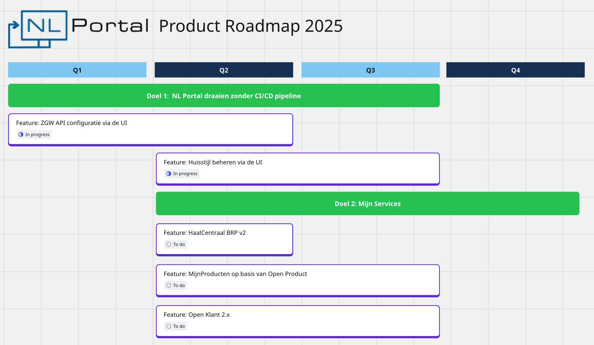

# Roadmap

De NL Portal roadmap wordt samengesteld door de stuurgroep, de items worden door de individuele partners gerealiseerd.

## Mijlpalen
Onderstaande mijlpalen worden opgeleverd om 

### ZGW configuratie via UI
ZGW-configuratie via UI maakt het mogelijk om ZGW (Zaken, Documenten en Zaken API) instellingen rechtstreeks via een gebruikersvriendelijke interface te beheren. Beheerders kunnen hiermee eenvoudig API-eindpunten, autorisaties, en overige ZGW-specifieke parameters configureren zonder handmatig config-bestanden aan te passen. Dit vergroot de flexibiliteit en verlaagt de kans op fouten bij integratie met ZGW-voorzieningen.

### Huisstijl configuratie via UI
Huisstijlconfiguratie via UI stelt beheerders in staat om de visuele stijl van de applicatie aan te passen via een gebruiksvriendelijke interface. Op basis van design tokens kunnen kleuren, typografie en componentstijlen worden geconfigureerd in lijn met het NL Design System. Hierdoor is het eenvoudig om de applicatie visueel af te stemmen op de huisstijl van een specifieke organisatie, zonder handmatige codewijzigingen. 

### Haalcentraal BRP v2
HaalCentraal BRP v2 integreert de applicatie met de vernieuwde versie van de BRP API van HaalCentraal. Hiermee kunnen actuele persoonsgegevens zoals naam, adres en geboortegegevens veilig en gestandaardiseerd worden opgehaald bij de basisregistratie. Versie 2 biedt verbeterde performance, uitgebreidere datastructuren en betere ondersteuning voor moderne API-standaarden, wat zorgt voor een robuuste en toekomstbestendige koppeling met de BRP.

### Open Product en Open Klant
De **Open Product**-feature in het NL Portal (zoals Open Inwoner of Open Zaak) is een module waarmee gemeenten centraal hun producten en producttypen kunnen beheren via een gebruiksvriendelijke beheersapplicatie. Denk aan:

- **Producttypen** zoals parkeervergunning, paspoortaanvraag of afvalbakplaatsing, inclusief regels, geldigheid en zones.
- **Producten** als individuele aanvragen — bijvoorbeeld de parkeervergunning van Jan Jansen met kenteken en adresgegevens.

Andere applicaties (zoals Open Inwoner of Open Formulieren) kunnen via een REST‑API:

- Lijsten met beschikbare producttypen ophalen;
- Nieuwe producten aanmaken;
- Actuele metadata tonen, zoals prijzen of geldigheidsduur.

Door deze gecentraliseerde aanpak ontstaat één bron van waarheid voor producten binnen het NL Portal-ecosysteem, wat onderhoud en integratie eenvoudiger en consistenter maakt.
