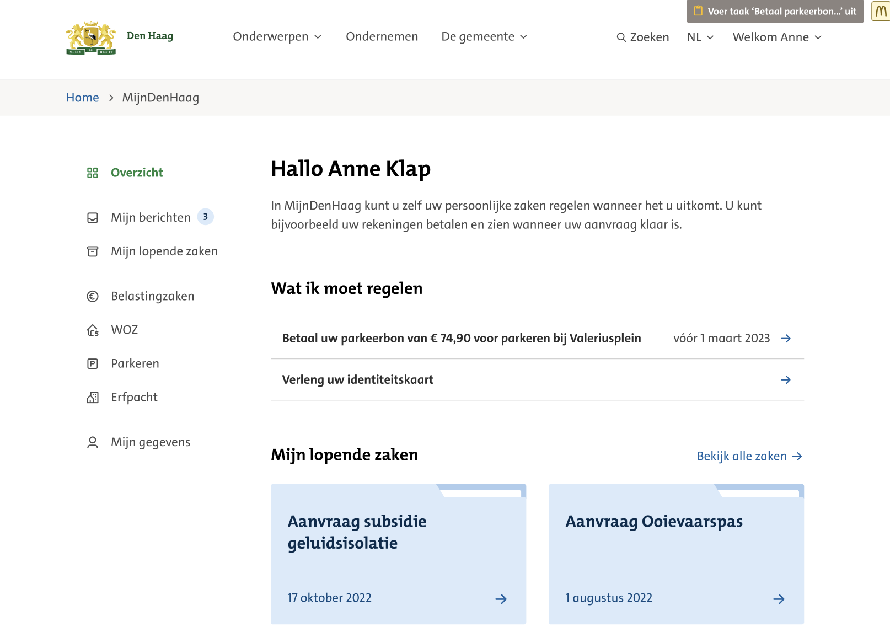
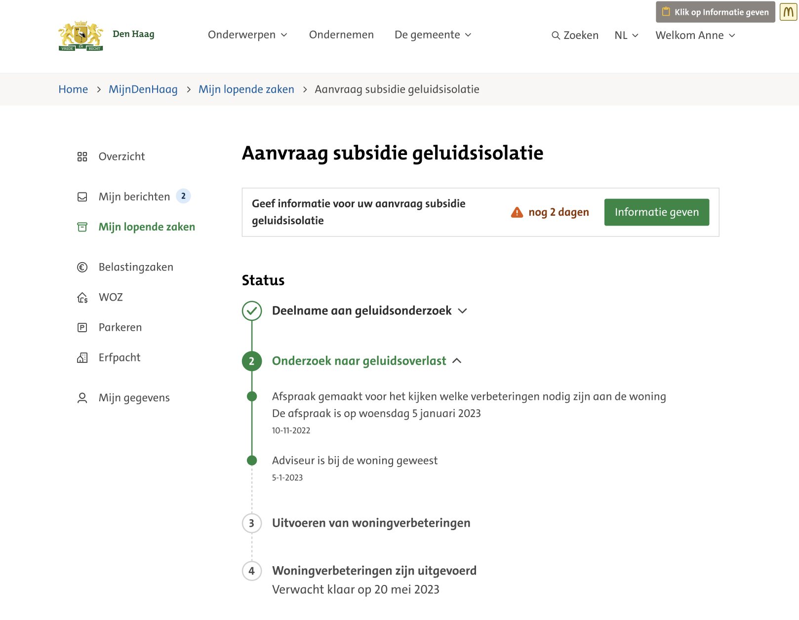
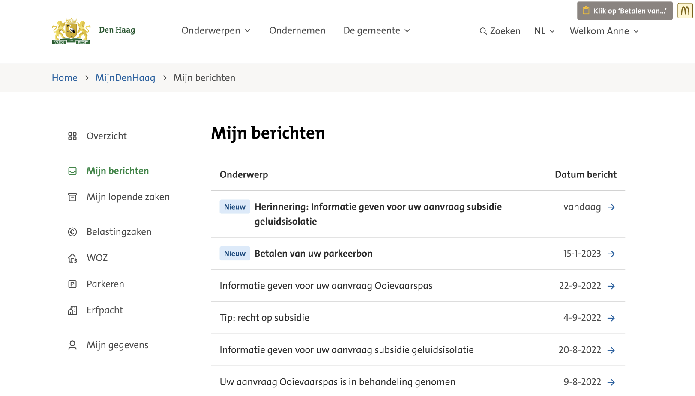
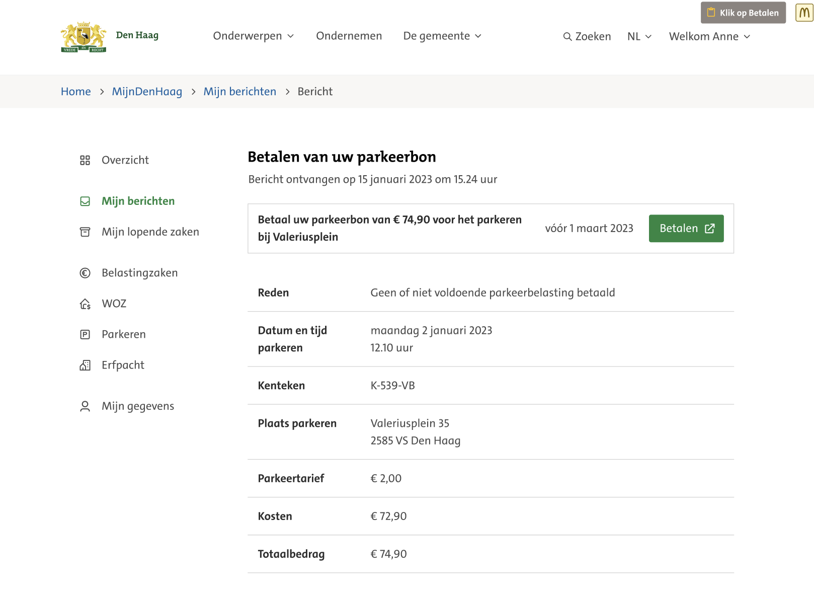
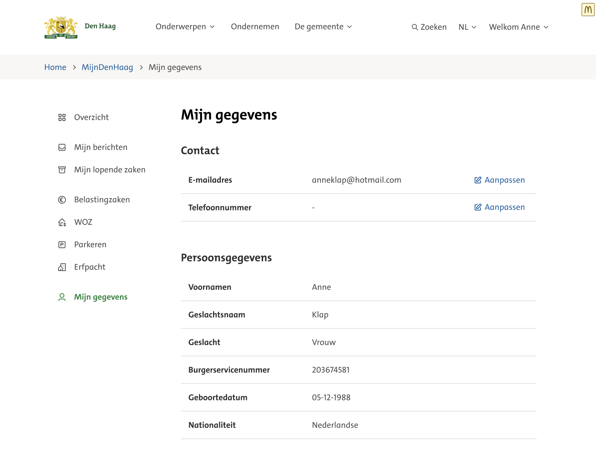
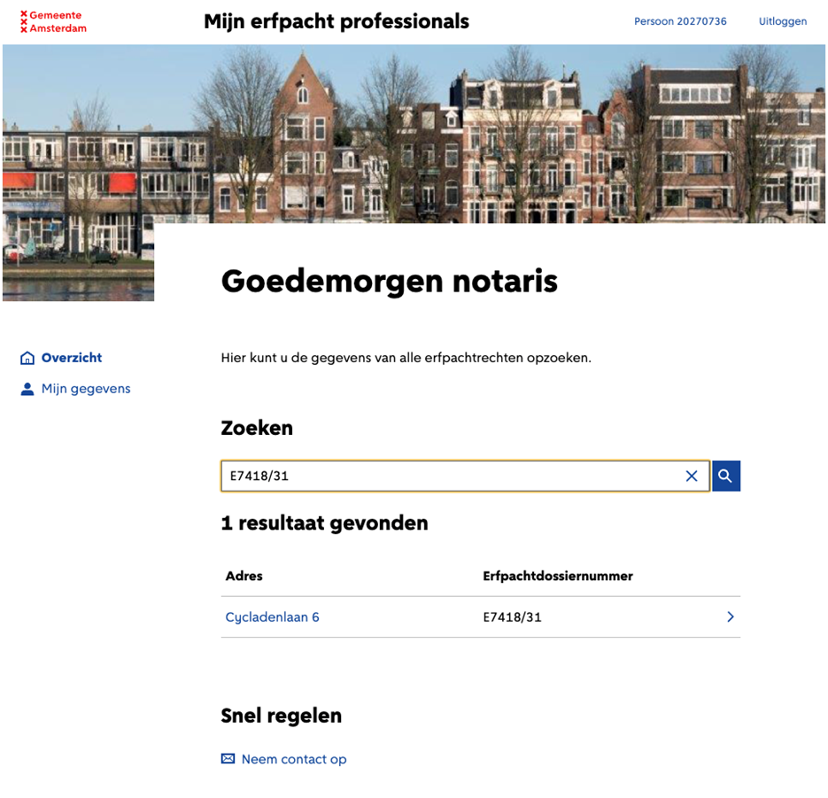
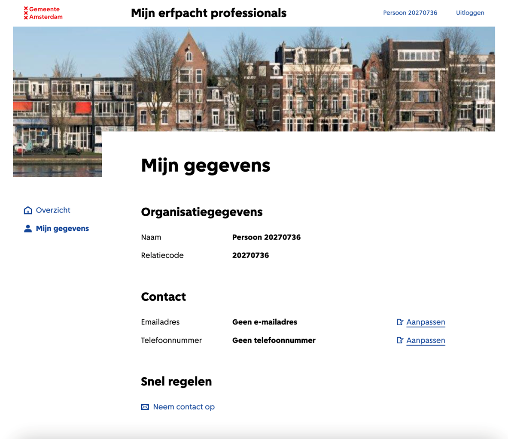

# Impressies

Het UX Design is ontwikkeld door de gemeente Den Haag, op basis van het [NL Design system](https://nldesignsystem.nl/). 
Den Haag beschikt over eigen UX lab, waarin de UX wordt getest met inwoners. Enkele impressies 
van ontwerpen van NL Portal in de _look & feel_ van de gemeente Den Haag.

## Gemeente Den Haag

In het onderstaande overzicht scherm staan alle lopende zaken van deze persoon en de openstaande
taken die uitgevoerd moeten worden.

*Overzichtscherm*

Bij de lopende zaken staan de stappen en de status van een specifieke zaak en welke taken hierbij 
open staan.

*Lopende zaken*

NL Portal wisselt berichten uit tussen de klant/ burger en de gemeente. Alle openstaande en 
afgehandelde berichten worden verzameld op deze pagina.

*Mijn berichten*

Door op een bericht te klikken worden de details van het bericht zichtbaar. Eventuele taken 
zoals betalingen kunnen direct worden uitgevoerd.

*Bericht - detailpagina*

Bij mijn gegevens staan de profielgegegevens van deze persoon en kunnen persoonsgegevens 
gewijzigd worden.

*Mijn gegevens*

## Gemeente Amsterdam

Op het overzicht scherm staan de openstaande zaken van de betreffende persoon of organisatie

*Overzicht*

Op de 'mijn gegevens' pagina staan de profiel gegevens van de persoon of organisatie en kunnen
de contactgegevens gewijzigd worden.

*Mijn gegevens*
